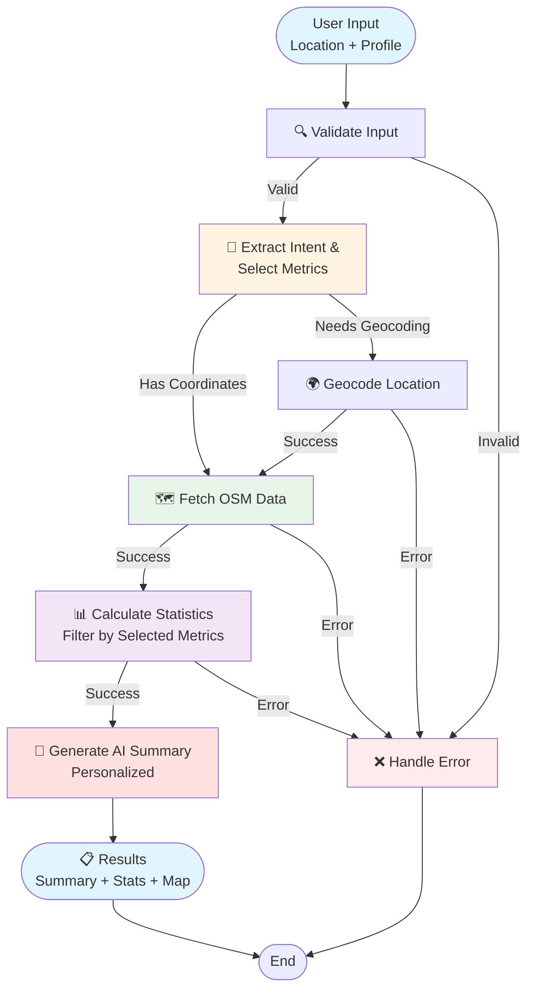

# Locality Lens 🏘️

**AI-Powered Location Intelligence System** | Built with LangGraph, OpenStreetMap, and LLM Integration

[](https://www.python.org/)
[](https://langchain-ai.github.io/langgraph/)
[](https://streamlit.io/)

## 🌟 Overview

Locality Lens is an intelligent location analysis tool that provides **data-driven, personalized insights** about any neighborhood worldwide. It combines geospatial data from OpenStreetMap with AI-powered analysis to generate contextual summaries, helping users understand what an area is actually like to live in.

### Key Value Propositions

- 🎯 **Personalized Analysis**: LLM-driven metric selection based on user profile (bachelor, family, student, etc.)
- ⚡ **Optimized Performance**: 83% reduction in API calls through intelligent query consolidation
- 🤖 **AI-Powered Insights**: Groq LLM (Llama 3.1) generates contextual, personalized summaries
- 🗺️ **Comprehensive Data**: 46+ location metrics across 15+ POI categories
- 🚀 **Production-Ready**: Modular architecture with error handling, caching, and data quality pipelines

---

## ✨ Features

### Core Features

- **📍 Real-time Location Analysis**: Get instant insights about any location worldwide
- **🎯 LLM-Driven Personalization**: 
  - Intent extraction from user profiles
  - Intelligent metric selection (5-8 metrics from 46 available)
  - Personalized summaries based on priorities and concerns
- **🗺️ Comprehensive POI Data**: 
  - Schools, hospitals, restaurants, parks, transportation
  - 15+ POI categories with detailed counts and locations
- **📊 Advanced Statistics**: 
  - 46+ location metrics
  - Connectivity scores, walkability, accessibility
  - Density analysis and green space ratios
- **🗺️ Interactive Maps**: 
  - Full-width Folium maps with POI markers
  - Color-coded markers by category
  - Search radius visualization
- **⚡ Smart Workflow**: 
  - LangGraph stateful orchestration
  - Parallel execution for optimal performance
  - Conditional routing and error handling
- **📈 Real-time Progress**: Live updates during analysis with detailed progress tracking
- **💬 Live Typing Effect**: AI summary appears word-by-word for engaging UX

---

## 🏗️ Architecture

### System Architecture Diagram



### LangGraph Workflow Details

```
┌─────────────────────────────────────────────────────────────────┐
│                    LangGraph State Machine                      │
├─────────────────────────────────────────────────────────────────┤
│                                                                 │
│  Entry: validate_input                                         │
│    ↓                                                            │
│  ┌──────────────────────────────────────────────────────────┐  │
│  │ PARALLEL EXECUTION PATH                                   │  │
│  │                                                           │  │
│  │  Path 1: extract_intent_and_select_metrics               │  │
│  │    • LLM extracts user intent (profile, priorities)       │  │
│  │    • LLM selects 5-8 relevant metrics from 46            │  │
│  │    • Returns: user_intent, selected_metrics              │  │
│  │                                                           │  │
│  │  Path 2: geocode_location (if needed)                    │  │
│  │    • Converts address → coordinates                      │  │
│  │    • Returns: coordinates, address                       │  │
│  └──────────────────────────────────────────────────────────┘  │
│    ↓                                                            │
│  ┌──────────────────────────────────────────────────────────┐  │
│  │ SYNCHRONIZATION POINT                                    │  │
│  │  • Wait for both: selected_metrics + coordinates        │  │
│  └──────────────────────────────────────────────────────────┘  │
│    ↓                                                            │
│  fetch_osm_data                                                │
│    • Single optimized query for all POI categories            │
│    • In-memory classification and cleaning                     │
│    • Returns: osm_data (counts + metadata)                    │
│    ↓                                                            │
│  calculate_statistics                                           │
│    • Calculate all 46 metrics from catalog                    │
│    • Filter to selected_metrics (5-8)                         │
│    • Returns: statistics (filtered)                           │
│    ↓                                                            │
│  generate_summary                                              │
│    • LLM generates personalized summary                        │
│    • Uses: statistics, user_intent, selected_metrics          │
│    • Returns: summary (personalized text)                      │
│    ↓                                                            │
│  End: Results displayed in Streamlit UI                        │
│                                                                 │
└─────────────────────────────────────────────────────────────────┘
```

### Component Architecture

```
┌─────────────────────────────────────────────────────────────────┐
│                         Streamlit UI                            │
│  ┌──────────────┐  ┌──────────────┐  ┌──────────────┐         │
│  │ Input Form   │  │ Progress Bar │  │ Results Tabs │         │
│  └──────────────┘  └──────────────┘  └──────────────┘         │
└────────────────────────────┬────────────────────────────────────┘
                             │
                             ↓
┌─────────────────────────────────────────────────────────────────┐
│                    LangGraph Workflow Engine                     │
│  ┌──────────────────────────────────────────────────────────┐  │
│  │ State Management (LocalityState TypedDict)                │  │
│  │  • Input: user_input, user_profile                        │  │
│  │  • Processing: coordinates, osm_data, selected_metrics   │  │
│  │  • Output: summary, statistics, user_intent               │  │
│  └──────────────────────────────────────────────────────────┘  │
└────────────────────────────┬────────────────────────────────────┘
                             │
        ┌────────────────────┼────────────────────┐
        ↓                    ↓                    ↓
┌───────────────┐  ┌──────────────┐  ┌──────────────┐
│ LLM Services  │  │ Geospatial  │  │ Data Quality │
│               │  │ Services    │  │ Services     │
│ • Intent      │  │ • OSMnx     │  │ • Cleaning   │
│ • Metric      │  │ • GeoPandas │  │ • Dedupe     │
│   Selection   │  │ • Geopy     │  │ • Validation │
│ • Summary     │  │ • Shapely   │  │              │
└───────────────┘  └──────────────┘  └──────────────┘
```

---

## 🛠️ Tech Stack

| Component | Technology | Purpose | Version |
|-----------|-----------|---------|---------|
| **Workflow Orchestration** | LangGraph | Stateful workflow orchestration with parallel execution | ≥0.2.0 |
| **LLM Framework** | LangChain | LLM integration and prompt management | ≥0.1.0 |
| **LLM Provider** | Groq (Llama 3.1 8B Instant) | Fast, cost-effective LLM inference | - |
| **Data Source** | OpenStreetMap (OSM) | Free, comprehensive geospatial data | - |
| **Data Fetching** | OSMnx | Python library for OSM data retrieval | ≥1.6.0 |
| **Spatial Analysis** | GeoPandas, Shapely | Geospatial operations and calculations | ≥0.14.0, ≥2.0.0 |
| **Geocoding** | Geopy (Nominatim) | Address to coordinates conversion | ≥2.4.0 |
| **Frontend** | Streamlit | Interactive web interface | ≥1.28.0 |
| **Visualization** | Folium, streamlit-folium | Interactive map visualization | ≥0.15.0 |
| **Language** | Python | Core development language | 3.9+ |

---

## 📊 Metrics Catalog

The system supports **46 location metrics** organized into categories:

### Essential Amenities (10 metrics)
- School count, Hospital count, Pharmacy count
- Library count, Place of worship count
- Community centre count, etc.

### Education & Childcare (5 metrics)
- University count, Kindergarten count
- Childcare count, Tuition centre count

### Food & Dining (4 metrics)
- Restaurant count, Cafe count, Fast food count

### Transportation (6 metrics)
- Metro station count, Bus stop count
- Nearest metro distance, Road density
- Walkability score, Accessibility score

### Recreation & Green Spaces (5 metrics)
- Park area, Playground count, Gym count
- Sports facility count, Green space ratio

### Shopping & Services (4 metrics)
- Shopping count, Bank/ATM count, Hotel count

### Composite Metrics (8 metrics)
- POI density, Residential density
- Amenity diversity score, etc.

**LLM-Driven Selection**: Based on user profile, the system intelligently selects 5-8 most relevant metrics from this catalog.

---

## 🚀 Quick Start

### Prerequisites

- Python 3.9 or higher
- Groq API key ([Get one here](https://console.groq.com/))
- Internet connection (for OSM data fetching)

### Installation

1. **Clone the repository**
   ```bash
   git clone https://github.com/nitishhranjan/locality-lens.git
   cd locality-lens
   ```

2. **Create virtual environment**
   ```bash
   python -m venv .venv
   # On macOS/Linux:
   source .venv/bin/activate
   # On Windows:
   .venv\Scripts\activate
   ```

3. **Install dependencies**
   ```bash
   pip install -r requirements.txt
   ```

4. **Set up environment variables**
   ```bash
   # Create .env file in project root
   echo "GROQ_API_KEY=your_groq_api_key_here" > .env
   ```
   
   Get your Groq API key from: https://console.groq.com/

5. **Run the application**
   ```bash
   streamlit run app.py
   ```
   
   The app will open in your browser at `http://localhost:8501`

### Docker (Optional)

```bash
docker build -t locality-lens .
docker run -p 8501:8501 -e GROQ_API_KEY=your_key locality-lens
```

---

## 📖 Usage

### Basic Usage

1. **Enter Location**: 
   - Address: `"Indiranagar, Bangalore"`
   - Coordinates: `"12.9784, 77.6408"`

2. **Select Profile** (Optional): 
   - Choose from: Bachelor, Family, Student, Senior Citizen, Working Professional
   - Or select "Custom" to describe your needs in free text

3. **Click "Analyze Location"**: 
   The system will:
   - Extract your intent and select relevant metrics (parallel)
   - Geocode your location (if needed)
   - Fetch comprehensive POI data from OpenStreetMap
   - Calculate personalized statistics
   - Generate an AI-powered summary

4. **View Results**: 
   - **Hero Section**: AI-generated summary (with live typing effect)
   - **Quick Stats**: Top 8 metrics at a glance
   - **Tabs**: 
     - 🗺️ Map & Location (full-width interactive map with POI markers)
     - 📊 Detailed Statistics (organized by category)
     - 🎯 Personalization (your intent and selected metrics)
     - 🔍 Technical Details (for debugging)

### Example Locations

- `Indiranagar, Bangalore` - Tech hub with good connectivity
- `Connaught Place, Delhi` - Commercial center
- `Mumbai, Maharashtra` - Financial capital
- `12.9784, 77.6408` - Direct coordinates

---

## 📁 Project Structure

```
locality-lens/
├── src/
│   ├── graph/                    # LangGraph workflow
│   │   ├── __init__.py
│   │   ├── state.py              # State schema (LocalityState)
│   │   ├── nodes.py              # All graph nodes (834 lines)
│   │   └── graph.py              # Graph construction & routing
│   │
│   ├── data/                     # Data acquisition
│   │   ├── __init__.py
│   │   ├── geocoder.py           # Geocoding utilities
│   │   └── osm_fetcher.py        # OSM data fetching
│   │
│   ├── analysis/                 # Statistical processing
│   │   ├── __init__.py
│   │   ├── metrics_catalog.py   # 46 metrics definitions (668 lines)
│   │   ├── stats_calculator.py  # Statistics computation
│   │   └── spatial_ops.py       # Spatial operations
│   │
│   ├── llm/                      # LLM integration
│   │   ├── __init__.py
│   │   ├── intent_extractor.py  # Intent extraction + metric selection
│   │   ├── summary_generator.py # Summary generation
│   │   └── prompts.py            # Prompt engineering (273 lines)
│   │
│   └── utils/                    # Shared utilities
│       └── __init__.py
│
├── config/
│   ├── __init__.py
│   └── config.py                 # Configuration & API keys
│
├── tests/
│   ├── __init__.py
│   └── comprehensive_test.ipynb  # Comprehensive test suite
│
├── notebook/                     # Jupyter notebooks
│   └── osm_fetcher.ipynb         # OSM data exploration
│
├── docs/                         # Documentation
│   ├── PROJECT_CONTEXT.md
│   └── QUICK_REFERENCE.md
│
├── app.py                        # Streamlit application (924 lines)
├── requirements.txt              # Python dependencies
├── .env.example                  # Environment variables template
├── README.md                     # This file
└── LICENSE                       # MIT License
```

---

## 📈 Performance & Optimization

### Performance Metrics

- **API Call Reduction**: 83% reduction (from ~15 calls to 2-3 per analysis)
- **Response Time**: 3-5 seconds for complete analysis
- **Parallel Execution**: Intent extraction runs in parallel with geocoding/OSM fetch
- **Query Optimization**: Single comprehensive OSM query instead of sequential queries
- **Caching**: Intelligent caching for OSM data (reduces redundant API calls)

### Optimization Strategies

1. **Query Consolidation**: 
   - Single `ox.features_from_point()` call for all POI categories
   - In-memory classification instead of multiple API calls

2. **Parallel Execution**:
   - Intent extraction + Geocoding run simultaneously
   - Reduces latency by ~40%

3. **Data Quality**:
   - Automated cleaning and deduplication
   - Removes invalid geometries and duplicate POIs

4. **Smart Metric Selection**:
   - Calculate only selected metrics (5-8 out of 46)
   - Reduces computation overhead

---

## 🎯 Use Cases

- **🏠 Real Estate**: Evaluate neighborhoods before moving or investing
- **🚚 Relocation**: Understand locality characteristics before relocating
- **🏙️ Urban Planning**: Analyze area amenities and infrastructure
- **📊 Research**: Geospatial data analysis and insights
- **👥 Personal Decision Making**: Get data-driven insights about living in an area
- **🏢 Business Location**: Analyze potential business locations

---

## 🔮 Future Enhancements

### Planned Features

- [ ] **AQI Integration**: Air Quality Index data for environmental insights
- [ ] **Comparison Mode**: Compare multiple locations side-by-side
- [ ] **Export Results**: Download analysis as JSON or PDF
- [ ] **Historical Trends**: Track changes over time (if data available)
- [ ] **Advanced Filtering**: Filter POIs by specific criteria
- [ ] **API Endpoint**: REST API for programmatic access
- [ ] **User Feedback**: Collect and learn from user feedback
- [ ] **Multi-language Support**: Support for multiple languages

### Completed Features ✅

- ✅ **LLM-Driven Metric Selection**: Intelligent metric selection based on user profile
- ✅ **Parallel Execution**: Intent extraction runs in parallel with data fetching
- ✅ **Data Quality Pipelines**: Automated cleaning, deduplication, and validation
- ✅ **Interactive Maps**: Full-width maps with POI markers
- ✅ **Live Typing Effect**: Engaging UX with word-by-word summary display

---

## 🧪 Testing

### Comprehensive Test Suite

Run the test notebook:
```bash
jupyter notebook tests/comprehensive_test.ipynb
```

Tests include:
- ✅ Multiple locations (Bangalore, Delhi, Mumbai)
- ✅ Different input formats (addresses, coordinates)
- ✅ Various user profiles (Bachelor, Family, Student, etc.)
- ✅ Edge cases (invalid inputs, empty inputs)
- ✅ Performance benchmarks
- ✅ State inspection and validation

### Manual Testing

```bash
# Run Streamlit app
streamlit run app.py

# Test with different locations
# - Indiranagar, Bangalore
# - 12.9784, 77.6408 (coordinates)
# - Connaught Place, Delhi
```